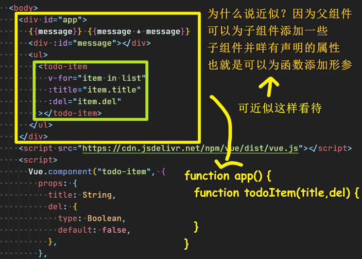
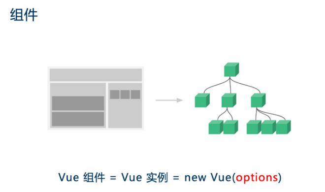
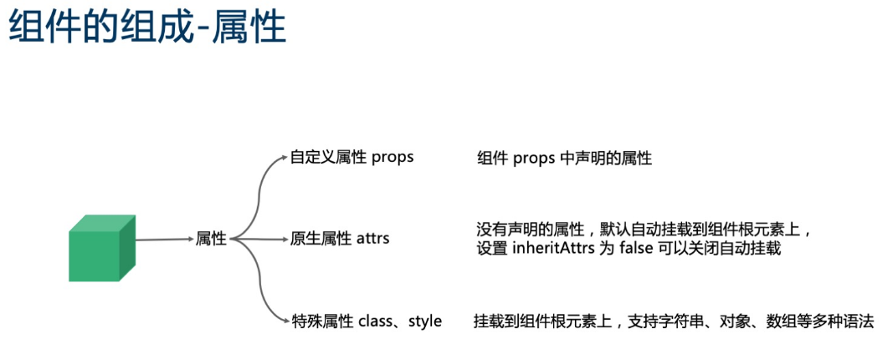
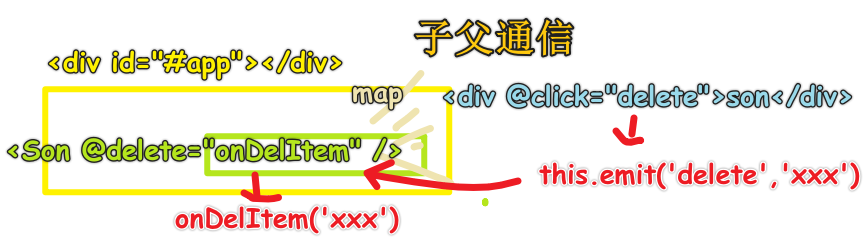
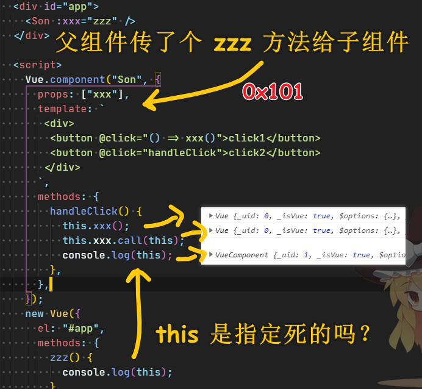

### ✍️ Tangxt ⏳ 2020-09-06 🏷️ 基础篇

# 01-第一个 Vue 程序、组件基础及组件注册、Vue 组件的核心概念：事件、Vue组件的核心概：插槽

## ★基础语法

- `data`、`el`
- 插值表达式 -> Mustache 的双括号语法（模板引擎常用） -> 不能用语句
- `v-bind`、`v-if`、`v-else`（是否从 DOM 树中移除）、`v-show`（本质是`display:none`）、`v-for`（写在重复的元素上，如`li`）

## ★组件基础及组件注册

> 文档：[组件基础 — Vue.js](https://cn.vuejs.org/v2/guide/components.html)、[组件注册 — Vue.js](https://cn.vuejs.org/v2/guide/components-registration.html)、[Prop — Vue.js](https://cn.vuejs.org/v2/guide/components-props.html)

1）知识点

- 组件是为了解决复用而诞生的，任何一个前端页面都可以抽象成一颗组件树！
- 注册一个组件，关于配置项里边的`data`是一个方法哈！ 该方法会返回一个对象 -> 为啥是这样呢？因为组件是复用的，如果你用了`{}`，那么这个`{}`就是公交车了！
- 全局注册的组件名是唯一的！
- 组件声明的`prop`，如`isDel`，那么写在组件标签上的属性就是 `is-del` 这样传参！

2）一些认识

父组件 vs 子组件



> 你可以在组件标签上写 `data-xxx = '666'` 这样的东西，`data-xxx` 并不是该组件声明的属性！

组件的本质：



> 每一个 Vue 组件其实就是一个 Vue 实例，而 Vue 实例是通过 `new` Vue 函数创建的，不同的组件不过是这个 `options` 配置对象的不同，我们业务开发的 90% 以上的代码都是在围绕配置这个 `options` 对象展开的！

组件的三大核心概念：属性、事件和插槽



> 没想到写在组件标签上的属性是分为 3 类的

## ★Vue 组件的核心概念：事件

- 给原生 DOM 绑定事件的方式：`@click="value"` -> `value`可以是语句，但更多时候，它是一个方法名！
- 给自定义组件绑定事件的方式：`@delete`+子组件实例主动把`delete`事件给抛出来（`this.$emit('delete'[,arg1[,arg2……])`）！ -> 这个抛事件是通过原生事件触发间接给抛出的！
- 事件有很多种，如键盘事件、鼠标事件、移动端的触摸事件等等
- 修饰符，如`.stop`阻止某个事件冒泡之类的 -> 注意，这些修饰符对自定义事件没效果



> 你把组件标签，看成是一个原生标签，我们要触发`delete`事件，显然需要透过浏览器提供的原生事件间接触发它的呀！

一些疑问：

Q：写在组件标签上的`:xxx`和`@yyy`，它们俩有啥区别？

- `:xxx` -> 这是**父子**传递数据的过程或标志 -> 接收数据的是 `props`
- `@yyy` -> 这是**子父**传递数据的过程或标志 -> 接收数据的是 `callback`

Q：父组件给子组件通过属性传了个函数，执行时 this 的指向仍旧是父组件，这个在 vue 里面是如何实现的？

`with this`



父组件`zzz`方法里边的`this`是确定的，不管哪个子组件实例调用它，还是我们用了「`call`的第一个参数就是`this`值」，`zzz`里边的`this`指向始终是父组件实例！

即便我这样做了：

``` js
with (this) {
  this.xxx();
  this.xxx.call(this);
}
```

也没有用！

## ★Vue组件的核心概：插槽


