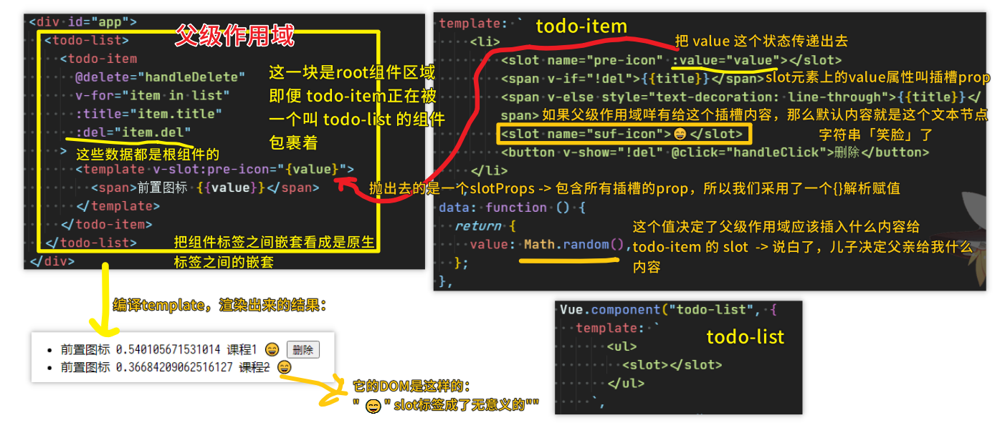
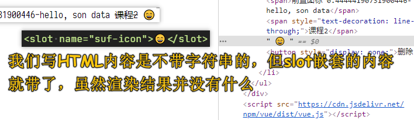
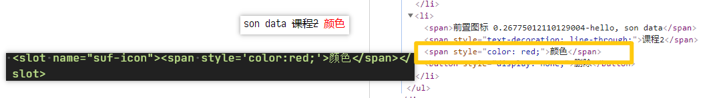
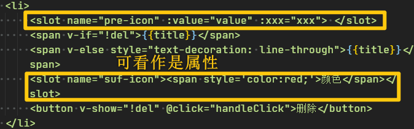
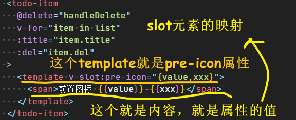
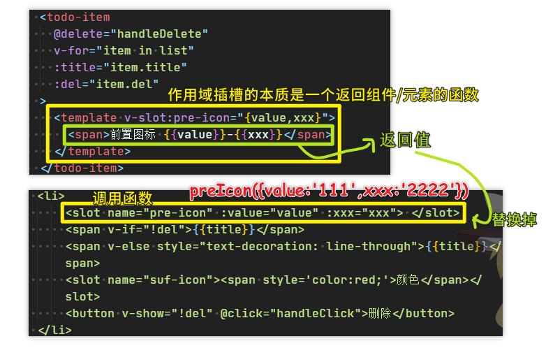
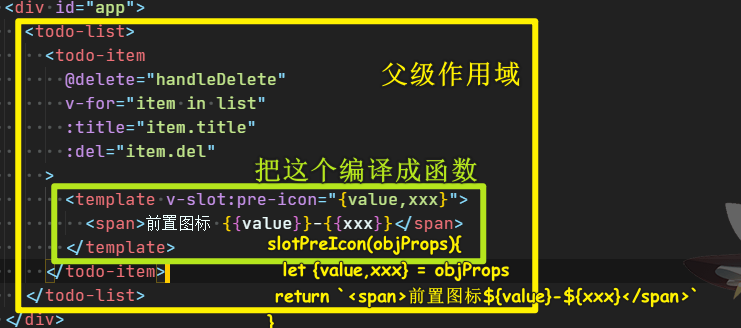
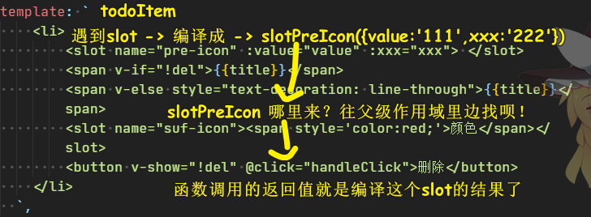
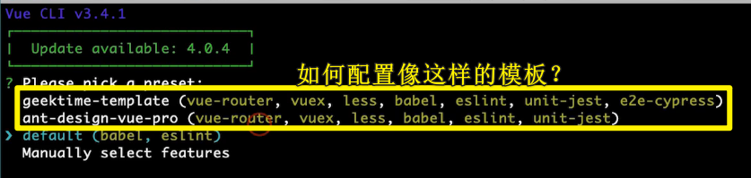
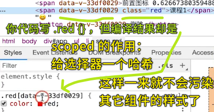

### ✍️ Tangxt ⏳ 2020-09-06 🏷️ 基础篇

# 01-第一个 Vue 程序、组件基础及组件注册、Vue 组件的核心概念：事件、Vue 组件的核心概：插槽

## ★基础语法

- `data`、`el`
- 插值表达式 -> Mustache 的双括号语法（模板引擎常用） -> 不能用语句
- `v-bind`、`v-if`、`v-else`（是否从 DOM 树中移除）、`v-show`（本质是`display:none`）、`v-for`（写在重复的元素上，如`li`）

## ★组件基础及组件注册

> 文档：[组件基础 — Vue.js](https://cn.vuejs.org/v2/guide/components.html)、[组件注册 — Vue.js](https://cn.vuejs.org/v2/guide/components-registration.html)、[Prop — Vue.js](https://cn.vuejs.org/v2/guide/components-props.html)

1）知识点

- 组件是为了解决复用而诞生的，任何一个前端页面都可以抽象成一颗组件树！
- 注册一个组件，关于配置项里边的`data`是一个方法哈！ 该方法会返回一个对象 -> 为啥是这样呢？因为组件是复用的，如果你用了`{}`，那么这个`{}`就是公交车了！
- 全局注册的组件名是唯一的！
- 组件声明的`prop`，如`isDel`，那么写在组件标签上的属性就是 `is-del` 这样传参！

2）一些认识

父组件 vs 子组件


> 你可以在组件标签上写 `data-xxx = '666'` 这样的东西，`data-xxx` 并不是该组件声明的属性！

组件的本质：


> 每一个 Vue 组件其实就是一个 Vue 实例，而 Vue 实例是通过 `new` Vue 函数创建的，不同的组件不过是这个 `options` 配置对象的不同，我们业务开发的 90% 以上的代码都是在围绕配置这个 `options` 对象展开的！

组件的三大核心概念：属性、事件和插槽


> 没想到写在组件标签上的属性是分为 3 类的

## ★Vue 组件的核心概念：事件

- 给原生 DOM 绑定事件的方式：`@click="value"` -> `value`可以是语句，但更多时候，它是一个方法名！
- 给自定义组件绑定事件的方式：`@delete`+子组件实例主动把`delete`事件给抛出来（`this.$emit('delete'[,arg1[,arg2……])`）！ -> 这个抛事件是通过原生事件触发间接给抛出的！
- 事件有很多种，如键盘事件、鼠标事件、移动端的触摸事件等等
- 修饰符，如`.stop`阻止某个事件冒泡之类的 -> 注意，这些修饰符对自定义事件没效果


> 你把组件标签，看成是一个原生标签，我们要触发`delete`事件，显然需要透过浏览器提供的原生事件间接触发它的呀！

一些疑问：

💡：写在组件标签上的`:xxx`和`@yyy`，它们俩有啥区别？

- `:xxx` -> 这是**父子**传递数据的过程或标志 -> 接收数据的是 `props`
- `@yyy` -> 这是**子父**传递数据的过程或标志 -> 接收数据的是 `callback`

💡：父组件给子组件通过属性传了个函数，执行时 this 的指向仍旧是父组件，这个在 vue 里面是如何实现的？

`with this`


父组件`zzz`方法里边的`this`是确定的，不管哪个子组件实例调用它，还是我们用了「`call`的第一个参数就是`this`值」，`zzz`里边的`this`指向始终是父组件实例！

即便我这样做了：

``` js
with (this) {
  this.xxx();
  this.xxx.call(this);
}
```

也没有用！

## ★Vue 组件的核心概：插槽

> 文档：[插槽 — Vue.js](https://cn.vuejs.org/v2/guide/components-slots.html)

1）知识点

> 父级模板里的所有内容都是在父级作用域中编译的；子模板里的所有内容都是在子作用域中编译的。 -> 插槽内容是不能访问子组件内部定义的数据的！

我们定义了这样一个组件`todo-item`的`template`：

> 用到了具名插槽 -> 不写`name`属性的`slot`那就是默认插槽了！

``` html
<li>
  <slot name="pre-icon"></slot>
  <span>带你去爬山</span>
  <slot name="suf-icon"></slot>
</li>
```

我们要插入内容或者说是分发内容，有两种姿势：

旧语法（`vue 2.5`的写法！）：

``` html
<todo-item>
  <span slot="pre-icon">前置 icon</span>
  <span slot="suf-icon">后置 icon</span>
</todo-item>
```

读法：根据这两个`span`的`slot`属性，把它们俩挂载到相应的那两个具名插槽的位置！ 

新语法（`vue 2.6`的写法）：

``` html
<todo-item>
  <template v-slot:pre-icon>
    <span>前置图标</span>
  </template>
  <template v-slot:suf-icon>
    <span>前置图标</span>
  </template>
</todo-item>
```

这两种语法都要去掌握，不管是新的还是旧的，毕竟有一些老系统依然使用的是`2.5`的语法！

对了，新语法的默认插槽是这样写的：

``` html
<template v-slot>插槽内容</template>
```

> 插槽内容可以是原生标签，也可以是组件标签

----

作用域插槽：

相较于默认插槽和具名插槽，它可以接收子组件传递过来的值 -> 简单来说，父组件根据子组件传递过来的不同的值，分发不同的内容给子组件



> 作用域插槽要解决的问题：父组件根据子组件`A`传上来的随机值，来决定父组件该分发啥内容给子组件……如小于`0.5`就给个红色的`icon`，大于等于`0.5`那就给个绿色的`icon`
> 
> 如果父组件没有传递插槽内容，那么子组件里边的那个插槽位置的默认值就是？`slot`标签里边的内容！

如果父级作用域咩有写插槽内容，我们用了文本节点，就会有莫名其妙的`""`：



而用了元素节点，则没有`""`：



但不管怎样，这都与我们所期望的渲染结果是一致的！

---

我们完全可以把插槽当作是复杂的属性（类似`props`这样）来看待：



如果我们通过属性传递复杂的内容：



为啥要这样看待了？

你想想如果我们这样做：

``` html
<todo-item icon="<Icon />"></todo-item>
```

我们可以传个组件标签或元素标签给`todo-item`这个组件吗？ -> 显然不可以，如果你真这样做了，那么这模板编译是不通过的！毕竟这`<`和`>`的对应关系并不好处理呀！

所以 Vue 就用了插槽这种复杂的形式来帮助我们的父组件传递复杂内容给子组件

作用域插槽本质上是一个返回组件的函数：



结合开头那句很重要的话来理解：

在父级作用域里边编译父级模版里边的所有内容：



轮到在子级作用域里边编译这个`todo-item`组件的`template`了：



> 如果父级作用域找不到，那就返回默认值，也就是 `slot`元素的内容！如果`slot`元素没有内容，那就删掉这个`slot`呗！不参与模板渲染呗！就当作我们从来没有写过这个`slot`元素一样！

---

小结：

插槽是一种传递复杂内容的方式 -> 仅仅是因为我们**无法在模板语法中使用简单的属性去传递这些复杂的内容** -> 所以 Vue 的作者才设计了这样一种 API 用来传递这些复杂的内容！

> 我们写 `slot` 标签就是在写一个函数调用！至于调用是否成功，就看父级作用域有咩有这函数的存在了！

一个疑问：

``` html
<div id="app">
  <todo-list>
    <todo-item></todo-item>
  </todo-list>
</div>
```

编译上边这个模板的时候，其编译顺序是怎样的？是从`#app`这个根组件开始，然后 `todo-list`，最后再到 `todo-item`吗？又或者是从里到外？这似乎又涉及到生命周期钩子的知识，如谁先`created`，谁先`mounted`之类的……

还有，为啥`#app`这个根组件可以插入内容？它的 `template` 定义我并没有看到它有`<slot></slot>`呀！

## ★理解单文件组件

1）为什么要用单文件组件？

因为使用全局定义的组件有很多缺点，如：

1. 你 `Vue.component('todo-item',{})` 这样，那么`todo-item`这个名字就是全局唯一的，当你页面的组件系统越来越庞大时，你就会发觉这给组件起名真 TM 难，因为你很有可能遗忘了你曾经起过这个名字！
2. 缺乏语法高亮 -> 用的是 ES6 语法字符串模板
3. 不支持 CSS 模块化 -> 很容易导致样式覆盖（需要我们自己管控好`class/id`命名）
4. 咩有构建（bulid）步骤 -> 意味着你只能使用兼容性好的 HTML、ES5 -> 简单来说，你不能使用预处理器，如`Babel`等

针对以上 4 个缺点，用`.vue` 这样的文件声明 vue 组件的姿势就出现了

当然，让`.vue`这样的文件生效，还得使用一系列的配套工具！

不过，幸好的是 vue 提供了 `vue-cli` 这样的脚手架工具来帮助我们搭建环境！（**不需要我们自己手动去装配套工具了，也不需要用 CDN 的姿势来引入 vue.js 了，还提供了代码的热更新功能**）

2）让代码从全局注册姿势迁移到单文件组件姿势

💡：对于 `vue-cli` ，如何配置代码模板？



> 组件树，也就是 Vue 实例树！ -> 组件会被复用，所以`data`是个函数然后返回一个`{}`！

💡：如何在一个单文件组件里边使用另一个单文件组件？

假如 `A` 单文件组件要使用 `B` 单文件组件：

1. 在 `A.vue` 里边，你要 `import` 一下 `B.vue` -> `import B from './B.vue'`
2. 然后在 `components` 选项里边局部注册 `B` -> `components: {B}`

> `B`组件不是全局注册的组件，只能在 `A.vue`的这个`template`作用域里边使用！

💡：我想全局注册一个组件，所以，我该怎么做呢？

在 `main.js` 这个入口文件里边注册就好了

``` js
// main.js
import A from './components/A.vue'
Vue.component('a-a',A)
```

你这样做了之后，在每个`Xxx.vue` 里边的 `template`里边，都可以直接使用`a-a`这个组件标签，无须再局部注册一下！

💡：关于 CSS 组件化？

在 `A.vue` 里边写样式，而这个样式，并不会污染其它组件的样式！

当然，不污染其它组件的样式的前提是你使用了`scoped`



没有`coped`，那么其它组件出现同名类，那么其它组件的样式就会受到影响了！

> `vue-cli`的热更新有时会抽风！

3）小结

- 相较于我们用CDN姿势引入 `vue.js`，然后在 html 文件里边写组件，单文件组件是真得香，虽然使用它，需要麻烦的环境搭建，但在后续使用单文件组件进行开发的过程里边，那是真得非常值的！
- 推荐在真实的项目里边，使用单文件组件进行开发！


