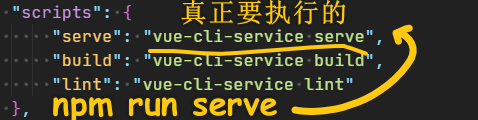

### ✍️ Tangxt ⏳ 2020-09-06 🏷️ faq

# FAQ

## 1、老师，如果说 vue 只支持 IE9 及以上版本，那么是不是会影响前端技术选型？是不是你们在做开发的时候放弃 IE8 的

> 这个要**看业务**了，一般中后台系统都是不支持低版本 ie 的，vue 不支持 ie8，组件库自然也没办法支持 ie8

## 2、Vue 的响应式更新原理？

> 具体详情看「虚拟 dom 和 template」这两节课

是

> 页面加载完后，把`id='app'`下的**内容取出**，生成**虚拟树结构**，然后根据虚拟树结构生成**真实 dom 树**，然后**替换 html** 

不是

> 当页面加载完毕后 Vue 迅速查找 DOM 中的`🟡🟡🟡🟡`定界符，将定界符和其中的内容用 `app.message` 替换掉 

## 3、现在很少有公司搭建框架是用 cli 生成的吧，不都是自己按照公司需求配置一个全新的吗？

> 现在 cli 相较于以前，已经很灵活了，尤其是 cli3，我们**在 cli 之上根据公司项目特点再行自定义**，可以节省我们很多的时间 当熟悉了整个生态后，并且 **cli 满足不了项目需求的时候，再去从零去配置一个"全新"的**也是可以的

## 4、关于 `vue.config.js` 里的配置，vue-cli 版本不同对我们有影响吗？如 vue-cli2 与 vue-cli3？

> 对于配置而言，版本并不重要，你根本无须了解二者的区别！

## 5、老师，常用的 VS Code 插件？

```
Das, eslint, gitlen, jest, vetur, vscode-icons , string manipulation
```

> Das 我猜是 Dash 插件 -> 此插件可以让你在写 `xxx` API 的时候，打开 `xxx` 的使用文档！

## 6、vue 文件如何使用外部 js 呢？

>  这要看外部 js 提供的使用方式，大部分直接`npm install xxx` 就可以使用，有些可能仅支持 `script src` 方式，这本身和用不用 vue 没有关系

## 7、在使用 vue-cli 的时候，咩有热更新？

Chrome 一直报`WDS：Disconnected.`

直接修改`npm script`：

``` json
{
  "scripts": {
    "serve": "vue-cli-service serve --host localhost",
    "build": "vue-cli-service build",
    "lint": "vue-cli-service lint"
  }
}
```

## 8、单文件？

单文件就是以`.vue`结尾的文件

## 9、`vue/cli` 是 `3.7.0`，但是为什么是 `v-slot:` 语法错误呢？

两种可能，第一 `v-slot`是 vue2.6 开始支持的，vue2.6 不是 `vue/cli3`， 两个是独立的，第二 `v-slot` 不支持原生标签，如 div span， 试着在 template 上使用

## 10、为什么组件注册一定要在 vue 实例创建之前呢，放在后面就不好使了，我猜测是不是跟创建过程有关啊，老师能否讲解一下？

> 不一定在实例之前，到一定要在使用之前

## 11、如果多页面用，vue 怎么写？

> 单页、多页 本身和 vue 没关系，只会涉及到打包构建并提供相应的入口文件即可。关于打包构建可以参考 cli 的文档：<https://cli.vuejs.org/zh/config/#pages>

## 12、完成功能的形式有很多种？

如元素字体的改变，你可以直接写在 `style` 属性里边，也可以写在单文件里边的`style`标签里边

如，你为了「讲作用域插槽的使用场景」，那么你可能会用了这种 `xxx` 形式来写！

## 13、请问为什么对象或数组默认值必须从一个工厂函数获取？

> 这和 `data` 必须是一个函数一样，**防止多个组件实例共享一份数据**，虽然属性默认值，我们不应该去修改它，但实际上，有些人的确去这么做了

## 14、以下两种声明有啥不一样？

``` js
{
  props: { a: 1 }
  data: function() {return { a: 1}
}
```

一个是属性，一个是状态， 属性的值来自于父组件传递，状态的值是组件自身的“值”

## 15、`:style` 的优先级是要高于 `style`的么？

实践证明是的

## 16、后续有没有基于 Vue 移动端的实战的课程？

Vue 在移动和 pc 的使用方式没有区别的，只是样式的不同，这本身和 vue 没关系

## 17、`npm run dev` 和 `npm run serve` 具体有啥区别？

`dev` 和 `serve` 只是自己起的名字，具体做什么用，是你自己在 `package.json` 的 `scripts` 字段中定义的



